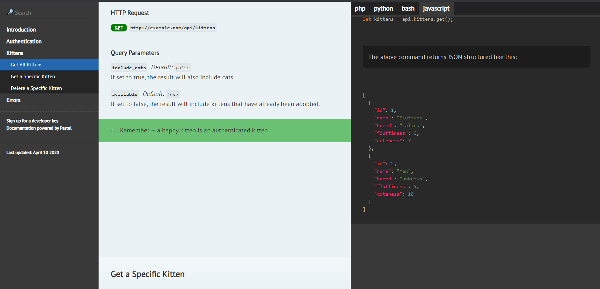
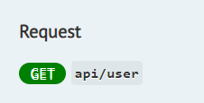
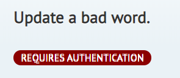
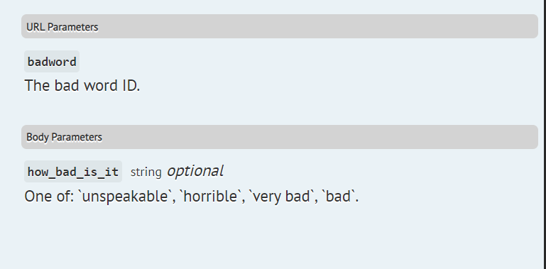

# Pastel 🎨

[](https://packagist.org/packages/knuckleswtf/pastel) 
[](https://travis-ci.com/knuckleswtf/pastel)
[](https://packagist.org/packages/knuckleswtf/pastel)

Pastel is a tool for generating pretty API documentation from Markdown. Write your docs in Markdown and let Pastel convert it to a HTML page, complete with:
- mobile responsiveness
- syntax highlighting for code examples in multiple languages
- a table of contents for easy navigation
- search functionality
- automatic "Last updated" tag, so your users know how fresh the docs are
- a logo, if you like
- custom HTML and CSS helpers for when you want to apply special styles
 
Want to see it in action? [Here's what the output looks like](https://knuckleswtf.github.io/pastel).

<p align="center">
  
</p>

Pastel was forked from [Documentarian](https://github.com/mpociot/documentarian), which is itself a PHP port of [Slate](https://github.com/slatedocs/slate), the API documentation tool. Here's a [Node.js version](https://github.com/knuckleswtf/pastel).

## Table of contents
- [Installation](#installation)
- [Usage](#usage)
  - [Writing your docs in Markdown](#writing-your-docs-in-markdown)
  - [Converting your Markdown file to HTML docs](#converting-your-markdown-file-to-html-docs)
  - [Styling helpers](#styling-helpers)
- [Integrations](#integrations)

## Installation
```bash
composer require --dev knuckleswtf/pastel
```
 
## Usage
With Pastel, you write your docs in Markdown, and you get complete HTML/CSS?JS output. Here's what you need to know:
 
### Writing your docs in Markdown
Start off with a single Markdown file. There are two parts:
 
#### The content
Your Markdown file should contain your docs, written as you like. There's no set format, but you can start with an introduction, talk about authentication and any general details, then describe each endpoint in its own section. Write example requests and responses using code blocks, use tables or paragraphs to describe request and response parameters.
  
There's a good example in the included example Markdown ([stubs/index.md](./stubs/index.md)) and the resulting HTML output ([docs/index.html](./docs/index.html)).
 
Pastel uses the same Markdown syntax as Slate. See [How to Edit Slate Markdown files](https://github.com/slatedocs/slate/wiki/Markdown-Syntax)

#### The front matter
The front matter is a YAML section in your Markdown file that comes before the actual content. It's separated from the main content by a line before and after it containing only "---" (see [stubs/index.md](./stubs/index.md)).
 
```
---
# This section is the front matter
title: API Docs
---

This section is the content.
```

The front matter provides "meta" information about a Markdown document's contents (in this case, the API doc).  You can use it to customise how your documentation will look like. Here are the values Pastel supports:

- `title`: The page title. This is used as the value of `<title>`, so it's only shown on the browser window.

- `language_tabs`: Array of languages to switch between in the code samples. Please list them in the same order your code blocks are. Supported languages for highlighting: `bash`, `csharp`, `go`, `java`, `javascript`, `php`, `python`, `ruby`.  You can use other languages too, but you won't get syntax hghlighting. 

- `toc_footers`: Array of items to add below your table of contents. See [Slate's docs](https://github.com/slatedocs/slate/wiki/External-Links-in-the-ToC).

- `logo`: If you'd like to use a logo on the sidebar, set this to the path to the logo image file. Must be either a URL or a path relative to the docs destination from a browser. The image will have to fit in a 230px width box (the sidebar), so make sure it scales nicely.

- `includes`: This is where you can append more files to the main Markdown file you're using. Each entry in this array is the path to a Markdown file relative to the main file. So, if your folder structure is like this:
 
```
source/
  |- index.md
  |- includes/
     |- errors.md
     |- appendix.md
```

you can append the other files to `index.md` by using

```
includes:
- ./includes/appendix.md
- ./includes/errors.md
```

You can also use `*` as a wildcard. In this case, files matching the pattern will be included in alphabetical order.
 
```
includes:
- ./includes/*.md
```

- `last_updated`: The date on which the docs were last updated. Helpful so your users know if they're looking at something stale. Leave this empty and it will automatically be set to the most recent time you edited your Markdown files (main or includes). If you want to set this manually, you can write whatever you want here. Pastel will render it as is.

Most of these sections can be disabled in the generated documentation by omitting them from the front matter.

### Converting your Markdown file to HTML docs

```bash
./vendor/bin/pastel generate docs_source/index.md docs
```

This will generate the HTML output from the file `docs_source/index.md` and place it, along with the needed CSS and JavaScript in your docs/ directory. You can replace `docs_source/index.md` with vendor/knuckleswtf/pastel/stubs/index.md to use the sample Markdown docs included with this package.

 
You can also call Pastel from PHP. This is especially useful if you're building a tool on top of it (see [Integrations](#integrations) below. Here's how you'd use it:
 
```php
 $pastel = new Knuckles\Pastel\Pastel();
 $pastel->generate("docs_source/index.md", "docs");
```
### Styling helpers
#### Badges
 

You can easily add badges by using the `badge` CSS class, along with one of the `badge-<colour>` classes.

```html
<small class="badge badge-darkred">REQUIRES AUTHENTICATION</small>

<small class="badge badge-green">GET</small>
```

Available colours:
- darkred
- red
- blue
- darkblue
- green
- darkgreen
- purple
- black
- grey

#### Fancy headings
You can help your lower-level headings stand out by using the `fancy-heading-panel` class:

```html
<h4 class="fancy-heading-panel"><b>Body Parameters</b></h4>
```



#### Notes and Warnings
You can add little highlighted warnings and notes using the `<aside>` tag and either of the classes "notice", "warning", or "success".

## Integrations
- [Scribe](https://github.com/knuckleswtf/scribe): Generate documentation for your Laravel API from your codebase.

## Todo
- Custom favicon support
- Customizable output templates